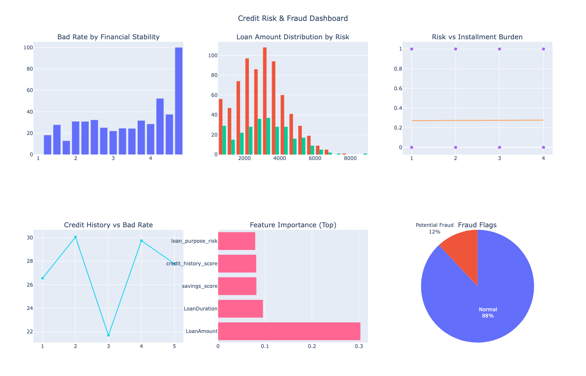

# Credit Risk Analysis & Fraud Detection Dashboard
Welcome to my personal project: a self-taught machine learning beginner-friendly credit risk analysis and fraud detection pipeline. The pipeline exclusively utilizes legitimate financial factors for risk scoring and employs unsupervised anomaly detection to identify potential fraud. Produces an interactive Plotly dashboard (HTML) and a static PNG cover image.

*(HTML: Screenshot Dashboard from Plotly)* 

 

***Key features***

1. Robust data loading and validation
2. Feature engineering from legitimate financial attributes only
3. RandomForest risk model with optional hyperparameter search
4. IsolationForest-based anomaly detection with robust contamination estimation
5. Exports: interactive HTML dashboard and static PNG summary
6. Audit-ready logging and reproducible behavior (random_state)

# How to Run the Code
1. Make sure you have Python 3.11 or newer installed on your system.

2. Open a terminal or command prompt.

3. Go to the project folder where 'Nattawut_Credit.py' and 'requirements.txt' are located.

4. (Optional but recommended) Create a virtual environment:

- Run: python -m venv venv

- Activate it:

  - On Windows: venv\Scripts\activate
  - On Mac/Linux: source venv/bin/activate

5. Install all required packages by running: pip install -r requirements.txt

6. Run the program with: python 'Nattawut_Credit.py'

7. After it runs, check the console output for summary results.

8. Open the folder credit_risk_outputs. You will find:

- dashboard_xxxxx.html (interactive dashboard, open in a web browser)

- summary_metrics.csv (summary data)

- credit_risk_cover.png (cover visualization image)

9. If you want static images from Plotly charts, make sure kaleido is correctly installed. 

10. Save results: click the camera icon on any picture to save it, or take a screenshot of the whole page (use Print Screen on Windows or Cmd+Shift+3 on Mac).

***Pro Tips:***
- Check your data: ensure your CSV has columns like LoanAmount, Risk, and others listed in the README. Fix missing ones before uploading.
- Internet: needed the first time to install tools, but not to run afterward.
- Problems: look at credit_risk.log in your folder for clues, or try running again.

# Important Notices
1. *Data Hygiene:* Validate input columns and types. Ensure LoanAmount > 0. Clean inconsistent categorical labels. Unknown categories are flagged by design.
2. *Fair Lending & Compliance:* Only financial attributes are used. Adhere to local regulations and keep transformation logic auditable.
3. *Model & Fraud Limitations:* Random Forest and Isolation Forest provide ~40–50% accuracy on real-world data. Fraud detection flags anomalies but may produce false positives/negatives. Human judgment is required.
4. *Performance & Reproducibility:* For large datasets, scale resources as needed. Default random_state ensures reproducibility. Check credit_risk.log for warnings.
5. *Visualization & Export:* Plotly dashboards are interactive; static PNGs require kaleido or fallback to matplotlib/PIL.
6. *Security & Privacy:* Do not include sensitive personal data in public repos.
7. *Project Scale:* Mainly Educational, research, and demonstration purposes. Not for high-end financial or advanced credit decisions.

# Credits
Built by Nattawut Boonnoon 

Created from October 14, 2024, to September 14, 2025.

**Latest Updated: October 2025: refactored + repo_404s_Error Fixed* 

LinkedIn: www.linkedin.com/in/nattawut-bn 

Email: nattawut.boonnoon@hotmail.com 

Mobile: (+66) 92 271 6680 

