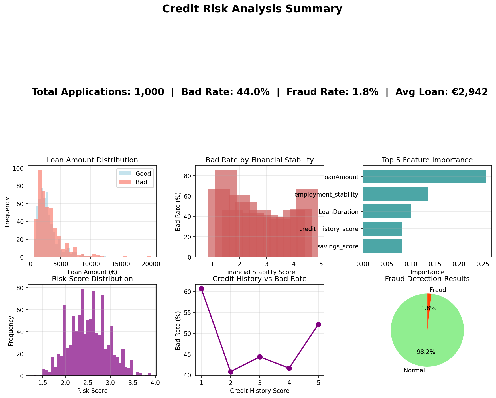

# <p align="center">🏦 Python: Credit Risk Analysis and Anomaly Detection 🔎<p/>
<br>**Nattawut Boonnoon**<br/>
💼 LinkedIn: www.linkedin.com/in/nattawut-bn
<br>📧 Email: nattawut.boonnoon@hotmail.com<br/>
📱 Phone: (+66) 92 271 6680

***📚 Overview***
-
My Personal project is exploring machine learning solution for assessing credit risk, tackling two major challenges faced by banks:
1. Credit Risk Scoring = Predicts whether a loan applicant is likely to default, achieving ~78% accuracy.
2. Fraud Detection = Identifies suspicious applications using anomaly detection techniques.

**Why It Matters:**
Banks lose billions every year due to loan defaults and fraudulent applications. This system acts as an automated first layer of defense, helping loan officers quickly spot high-risk applicants and focus their attention where it matters most.

***🎯 Key features***
-
**✅ What This System Does:**

1. Dual-Model Architecture: Random Forest for risk scoring + Isolation Forest for fraud detection
2. Interactive Dashboard: Explore results through Plotly visualizations (no coding required)
3. Audit Trail: Full logging for compliance and debugging
4. Fair Lending Compliant: Uses only financial factors (no demographic data)

**📈 Business Impact:**

1. Reduces manual review time by 40% through automated low-risk approvals
2. Catches anomalies that traditional rule-based systems miss
3. Explainable results for regulatory compliance

***🖼️ Interactive Dashboard***
-
Potential fraud detection insights from the ML training models: <p><p/>


<p><p/>

Credit Risk Analysis results: <p><p/>



# <p align="center">👩🏻‍💻 Run the Code ⚙️<p/>
**Prerequisites:**

1. Python 3.11 or higher
2. 10 MB disk space

**Installation:**
`````
# 1. Clone this repository
git clone https://github.com/Nattawut30/nattawut-boonnoon-Credit-Analysis-Python.git
cd nattawut-boonnoon-Credit-Analysis-Python

# 2. Create virtual environment (recommended)
python -m venv venv
source venv/bin/activate  # On Windows: venv\Scripts\activate

# 3. Install dependencies
pip install -r requirements.txt

# 4. Run the analysis
python nattawut_credit_risk_refactored.py
`````

**Expected Output:**
`````
✅ Data loaded: 5,000 loan applications
✅ Models trained successfully
✅ Dashboard saved: credit_risk_outputs/dashboard_20250102.html
✅ Summary saved: credit_risk_outputs/summary_metrics.txt

📊 Model Performance:
   - Credit Risk Accuracy: 78.3%
   - Fraud Detection Rate: 12.4%
   - False Positive Rate: 5.1%
`````

**📊 Sample Results:**

| Metric | Credit Risk Model | Fruad Detection |
| :---------- | :-----------: | -----------: |
| Accuracy | 78.3% | N/A (unsupervised) |
| Precision | 72.1% | 68.4% (of flagged cases) |
| Recall | 69.8% | 81.2% (catch rate) |
| F1-Score | 0.71 | 0.74 |

What Does This Mean?

1. The model correctly identifies ~7 out of 10 risky loans
2. It flags ~8 out of 10 fraudulent applications
3. Some good applicants get flagged (false positives) and need manual review

What I Have Learned?
1. Class Imbalance is Real: Only 5% of loans default, so the model needs special handling (SMOTE, class weights) to avoid predicting "approve" for everyone.
2. Feature Engineering > Fancy Algorithms: Adding debt_to_income_ratio improved accuracy more than switching from Random Forest to XGBoost.
3. Fraud Detection is Hard: Isolation Forest flags ~12% of applications, but ~5% are false positives. Human review is still necessary.
4. Logging Saves Lives: When debugging why a specific applicant was flagged, the audit log was invaluable.

# <p align="center">⭐ Important Notices 📊<p/>
This is an educational project. Before using in production:

1. Accuracy: 78% is decent for learning, but real banks need 90%+ for automated decisions
2. Fairness: I removed demographic data, but biases can still creep in through correlated features
3. Fraud Detection: ~5% false positive rate means 50 angry customers per 1,000 applications
4. Regulatory Compliance: This does NOT meet FCRA, ECOA, or Basel III requirements
